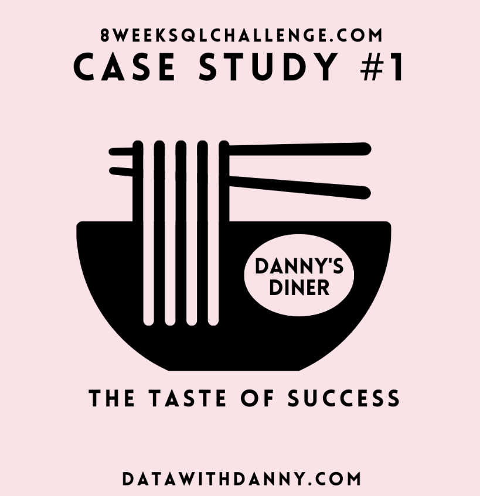

# Dannys_Diner_Challenge
This is Week 1 of SQL Challenge from Danny's Challenges. You can find more information about the challenge [here](https://8weeksqlchallenge.com/case-study-1/)
- In this Challenge, I've analyzed the Danny's Diner using MySQL workbench and various functions such as [ Case, CTE's, denserank, window functions, rownumber etc. ]
- It was really fun Challenge and worth trying for everyone as it provides a lot of learnings along the journey. 
 
                                                        
